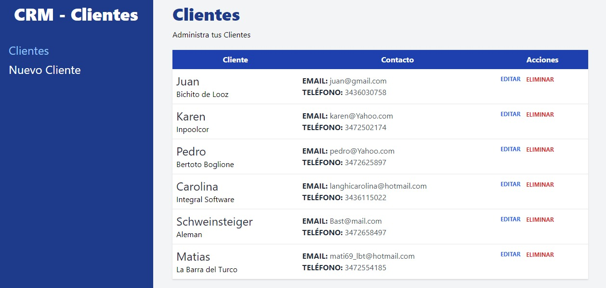
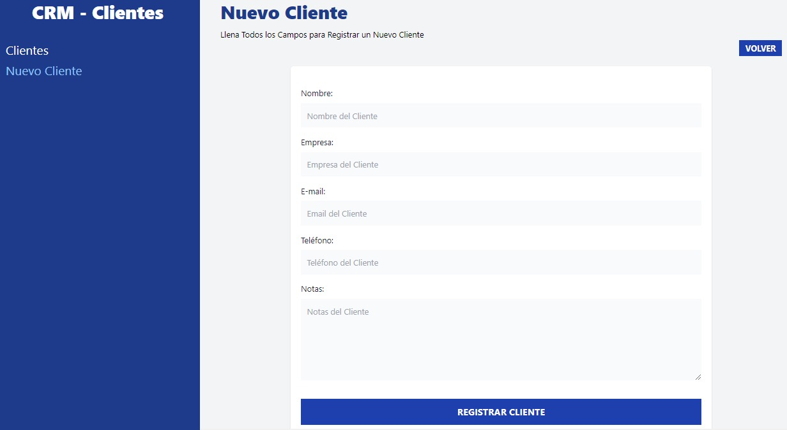

# CRM con React y Vite usando Tailwind CSS

Este proyecto es un CRM (Customer Relationship Management) desarrollado con React y Vite, y utiliza Tailwind CSS para el diseño y estilos. El objetivo principal de este proyecto es practicar el enrutamiento multipágina y el uso de componentes reutilizables.

## Funcionalidades

- Almacenamiento de clientes: Permite almacenar información de clientes en el sistema.
- Enrutamiento multipágina: Utiliza React Router DOM para crear una aplicación con diferentes URL y mantener un mejor orden en las páginas.
- CRUD: Implementa operaciones básicas de crear, leer, actualizar y eliminar clientes.
- Loader: Incluye un componente de carga para mejorar la experiencia del usuario durante las operaciones asíncronas.
- Formularios: Utiliza formularios para la entrada de datos y validación.
- JSON Server: Se utiliza un servidor JSON local para simular una API y realizar las operaciones CRUD.

## Requisitos de instalación y configuración

1. Clona este repositorio en tu máquina local.
2. Ejecuta `npm install` para instalar las dependencias.
3. Luego, ejecuta `npm run json-server` para iniciar el servidor JSON local.
4. Finalmente, ejecuta `npm run dev` para iniciar la aplicación en modo de desarrollo.

## Estructura del proyecto

- `index.html`: Archivo HTML principal.
- `config`: Directorio que contiene la configuración del servidor JSON.
- `src`: Directorio principal del código fuente.
  - `components`: Directorio que contiene componentes reutilizables.
  - `data`: Directorio que contiene el archivo `clientes.js` para realizar las operaciones CRUD.
  - `pages`: Directorio que contiene las páginas de la aplicación.
  - `index.css`: Archivo CSS principal.
  - `main.jsx`: Archivo principal de entrada de la aplicación.

## Dependencias principales

- React: ^18.2.0
- React Router DOM: ^6.11.1
- Tailwind CSS: ^3.3.2

## Capturas de pantalla

_Index._

_Nuevo Cliente._

## Problemas conocidos

- El proyecto actualmente no se encuentra desplegado en ningún servidor o plataforma.

